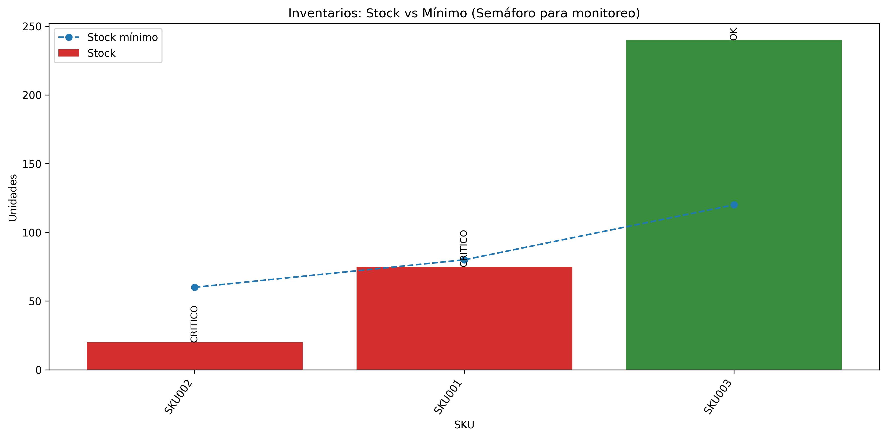

# Inventory Risk Monitoring Dashboard (Supply Chain)

Dashboard operativo para **monitoreo de inventarios y riesgo** con semáforo **CRÍTICO / LÍMITE / OK**.
Enfocado en **visibilidad, anticipación y control** para entornos industriales.

## Business Impact
- Detecta riesgo de quiebre antes de impactar producción
- Prioriza SKUs críticos para seguimiento
- Mejora visibilidad operativa con KPIs simples y explicables
- Apoya decisiones en jefatura/gerencia (monitoreo, no reemplazo del criterio)

## Output (Dashboard)
**1) Stock vs Mínimo (Semáforo)**


**2) Operational Risk Dashboard (KPIs + ranking)**


## How to run
```bash
pip install -r requirements.txt
python src/generate_dashboard.py
